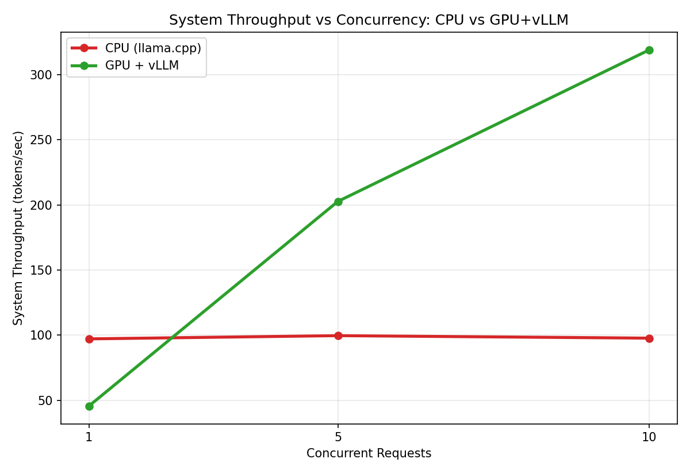
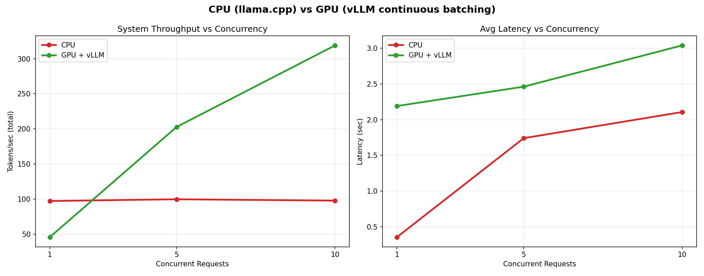

# LLM Inference Server

A production-style LLM inference server built from scratch to explore the core problem of AI infrastructure: **not how to train a model, but how to serve one efficiently, under real concurrent load.**

This project benchmarks the same serving workload on two different stacks — a naive CPU setup and a GPU server running vLLM's continuous batching — to measure, concretely, why specialized inference engines exist.

---

## TL;DR — The Headline Result

| Concurrency | CPU (llama.cpp, thread-locked) | GPU + vLLM (continuous batching) |
|---|---|---|
| 1 | 97.16 tok/s | 45.63 tok/s |
| 5 | 99.64 tok/s | 202.73 tok/s |
| 10 | 97.72 tok/s | **319.03 tok/s** |

**On CPU, system throughput plateaus around ~97 tok/s no matter how many concurrent requests arrive — the server just queues them. On GPU with vLLM, throughput scales nearly 7x (45 → 319 tok/s) as concurrency increases from 1 to 10.** This is continuous batching working as designed, measured directly rather than assumed.



---

## Why This Project

Training a model is only half the job in production AI. The bigger, ongoing problem most companies face is **inference**: taking an already-trained model and serving it to real users, fast, concurrently, and without burning through GPU budget. This project is a hands-on exploration of that exact problem — building a serving layer, finding its real bottleneck, and validating the fix with a proper batching-aware engine.

---

## Architecture

```
                     ┌─────────────────────┐
   Client (curl /    │                     │
   benchmark script) │──POST /generate────▶│   FastAPI Server
                      │──POST /stream──────▶│   (server/main.py)
                      │                     │
                      └─────────────────────┘
                                │
                                ▼
                     ┌─────────────────────┐
                     │  Inference Engine    │
                     │  (loaded once at     │
                     │   server startup)    │
                     └─────────────────────┘

  CPU path:  llama-cpp-python + threading.Lock()  → TinyLlama 1.1B (Q4_K_M GGUF)
  GPU path:  vLLM server (continuous batching)     → Mistral-7B-Instruct (AWQ 4-bit)
```

Both paths expose the same style of interface (a `/generate`-equivalent HTTP endpoint) and were benchmarked with the identical methodology, so the comparison is apples-to-apples on *serving behavior under concurrency*, even though the models differ in size.

---

## What's Implemented

- **`POST /generate`** — standard request/response inference endpoint, built with FastAPI + Pydantic schemas for input validation.
- **`POST /stream`** — Server-Sent Events (SSE) streaming endpoint, returning tokens one at a time as they're generated (the same mechanism behind ChatGPT-style "typing" UIs), implemented as a Python generator wrapping `llama-cpp-python`'s `stream=True` mode.
- **Concurrency-safe serving** — a real thread-safety bug was found and fixed during development (see below).
- **A concurrency benchmarking suite** (`benchmarks/run_benchmark.py`) — fires requests using `ThreadPoolExecutor` at concurrency levels of 1, 5, and 10 simultaneous users, measuring per-request latency, per-request tokens/sec, and total system throughput.
- **Chart generation** (`benchmarks/generate_charts.py`) — turns raw benchmark JSON into comparison plots via matplotlib.
- **A real GPU validation pass** — the same benchmark methodology run against a vLLM server (Mistral-7B-AWQ) on a T4 GPU, to measure the actual effect of continuous batching.

---

## The Bug That Explains Why vLLM Exists

Early in benchmarking, running the CPU server at concurrency=5 caused **every single request to fail** — some erroring instantly, others hanging until timeout. The root cause: `llama-cpp-python`'s basic model object is **not thread-safe**. Multiple threads calling it simultaneously corrupted internal state.

The fix was a `threading.Lock()` around every inference call, forcing concurrent requests to safely queue one-at-a-time instead of crashing. This made the server correct — but it also produced the flat CPU throughput line in the results above, since one-at-a-time queuing means adding more concurrent users never increases total work done, only wait time.

**This is precisely the problem vLLM's continuous batching is built to solve** — instead of queuing requests one-at-a-time, it schedules multiple requests' GPU computation together, genuinely increasing throughput as load increases. The results table above is the direct, measured proof of that difference.

---

## Benchmark Methodology

For both the CPU and GPU runs:
- **3 concurrency levels tested:** 1, 5, and 10 simultaneous requests
- **10 requests per level**, cycling through 5 varied prompts to avoid skew from any single prompt
- Requests fired concurrently via `ThreadPoolExecutor`, simulating real overlapping users rather than sequential calls
- Measured: **client-side latency** (real round-trip time), **per-request tokens/sec**, and **system throughput** (total tokens generated ÷ total wall-clock time — the number that matters for capacity planning)

### Full Results

**CPU — TinyLlama 1.1B (Q4_K_M), llama.cpp, thread-locked:**

| Concurrency | Avg Latency (s) | Avg Tokens/sec (per request) | System Throughput (tok/s) |
|---|---|---|---|
| 1 | 0.355 | 49.91 | 97.16 |
| 5 | 1.741 | 33.21 | 99.64 |
| 10 | 2.107 | 20.10 | 97.72 |

**GPU — Mistral-7B-Instruct (AWQ 4-bit), vLLM continuous batching, NVIDIA T4:**

| Concurrency | Avg Latency (s) | Avg Tokens/sec (per request) | System Throughput (tok/s) |
|---|---|---|---|
| 1 | 2.191 | 45.65 | 45.63 |
| 5 | 2.462 | 40.63 | 202.73 |
| 10 | 3.040 | 32.47 | 319.03 |



**Reading the tradeoff:** at concurrency=1, the CPU setup actually looks faster in raw tok/s — a single request doesn't benefit from batching, and vLLM's engine has more fixed overhead (scheduling, kernel launches) than a bare inference call. The real story shows up under load: GPU+vLLM throughput keeps climbing as concurrency increases, while CPU throughput is capped by its fixed, single-threaded processing ceiling regardless of how many users are waiting.

---

## Tech Stack & Why

| Choice | Reasoning |
|---|---|
| **FastAPI** | Async-native, automatic request validation via Pydantic, minimal boilerplate for a serving layer |
| **llama-cpp-python (CPU path)** | Runs quantized GGUF models on CPU with no GPU dependency — useful for local development and establishing a baseline |
| **vLLM (GPU path)** | Industry-standard inference engine; continuous batching + PagedAttention are the specific mechanisms that let a GPU serve many concurrent requests efficiently, which is exactly what this project set out to measure |
| **AWQ 4-bit quantization** | Reduces model memory footprint (fits Mistral-7B comfortably on a 15GB T4) with minimal accuracy loss vs full precision |
| **Server-Sent Events (SSE) for streaming** | Simpler than WebSockets for one-directional token streaming; same mechanism used by OpenAI's and Anthropic's own streaming APIs |

---

## Project Structure

```
llm-inference-server/
├── .gitignore
├── test_model.py                 # Phase 1: raw CPU inference sanity check
├── server/
│   └── main.py                   # FastAPI app: /generate, /stream, thread-safe
├── benchmarks/
│   ├── run_benchmark.py          # Concurrency benchmark suite (CPU)
│   ├── generate_charts.py        # Builds PNG charts from benchmark results
│   └── results/
│       ├── latency_vs_concurrency.png
│       ├── per_request_throughput.png
│       ├── system_throughput.png
│       ├── summary_combined.png
│       ├── cpu_vs_gpu_throughput.png
│       ├── cpu_vs_gpu_latency.png
│       └── cpu_vs_gpu_summary.png
└── models/                       # Model weights (not committed — see below)
```

*Model weight files (`.gguf`) are excluded from version control via `.gitignore` — they're large binary artifacts that should be downloaded independently, not stored in Git.*

---

## Running It Locally (CPU path)

```bash
# 1. Set up environment
python3 -m venv venv
source venv/bin/activate
pip install llama-cpp-python fastapi uvicorn pydantic requests matplotlib

# 2. Download a quantized model
mkdir models
curl -L -o models/tinyllama.gguf \
  "https://huggingface.co/TheBloke/TinyLlama-1.1B-Chat-v1.0-GGUF/resolve/main/tinyllama-1.1b-chat-v1.0.Q4_K_M.gguf"

# 3. Start the server
uvicorn server.main:app --reload

# 4. Test it
curl -X POST http://127.0.0.1:8000/generate \
  -H "Content-Type: application/json" \
  -d '{"prompt": "What is inference in machine learning?", "max_tokens": 80}'

# 5. Run the benchmark suite
python3 benchmarks/run_benchmark.py
python3 benchmarks/generate_charts.py
```

## Running the GPU path (vLLM)

Requires an NVIDIA GPU (tested on a free-tier Colab T4). See `benchmarks/gpu_benchmark.py` for the concurrency benchmark script used against the vLLM server, launched via:

```bash
vllm serve TheBloke/Mistral-7B-Instruct-v0.2-AWQ \
  --quantization awq --dtype float16 \
  --gpu-memory-utilization 0.85 --max-model-len 4096 --port 8000
```

---

## What I'd Do With More GPU Budget

- Run the same benchmark at higher concurrency (25, 50, 100) to find where GPU throughput eventually plateaus
- Compare vLLM against TGI and raw HuggingFace `transformers` serving on the same hardware
- Add a quantization sweep (FP16 vs AWQ vs GPTQ) with accuracy benchmarks alongside speed, not just speed alone
- Deploy behind an autoscaler (KServe/Ray Serve) and measure cold-start latency

---

## Author

Built by Vignesh Raju as a hands-on portfolio project targeting AI inference / infrastructure engineering roles.
